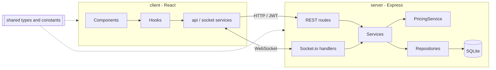

# Bar Boursier

[](https://github.com/Timochee/BarBoursier/actions/workflows/ci.yml)

A stock-exchange bar: beer prices move in real time with every purchase. The market is **zero-sum**: when some beers go up, others go down by the same total amount.

**Live demo:** [barboursier.onrender.com](https://barboursier.onrender.com) (free tier, the first load can take ~30 s to wake up)

## Features

- **Real-time prices** pushed to every screen over WebSocket
- **Zero-sum pricing engine** with sector correlations, mean reversion and crash protection
- **Price chart** by sector or by beer, plus a full-screen TV mode for the bar
- **Google sign-in** with three roles: guest (read-only), admin (sell beers), superadmin (manage beers, admins, presets, reset)
- **Market presets** to save and restore a beer lineup
- Dark / light theme, responsive layout

## Tech stack

| Layer | Stack |
|-------|-------|
| Frontend | React 18, TypeScript, Vite, TailwindCSS, React Query, Recharts, Socket.io client |
| Backend | Node.js 22, Express, Socket.io, better-sqlite3, Passport (Google OAuth 2.0), JWT, Pino |
| Shared | Workspace package with domain types, constants and pricing configuration |
| Quality | Vitest, strict TypeScript, GitHub Actions CI |
| Deployment | Multi-stage Docker image (non-root, `/health` endpoint) on Render |

## Architecture



- **Routes and socket handlers** authenticate, validate and translate; they hold no business logic.
- **Services** own the use cases (`MarketService.buy`, `reset`, chart data).
- **`PricingService`** is a pure function of the market state, which makes the pricing rules unit-testable without a database.
- **Repositories** are the only layer that talks SQL, always through prepared statements.
- Roles are resolved server-side on every request from the database, never trusted from the token.

## Pricing engine

On each purchase:

1. The purchased beer rises by `baseMove × volatility × price × quantity^0.7` (bulk orders are dampened).
2. Beers in the same sector follow, weighted by `sectorCorrelation` and relative volatility.
3. Beers in other sectors absorb the increase, weighted by a sector affinity matrix and their volatility.
4. Protections: max 10% drop per transaction, a brake near the price floor, and hard min/max prices.
5. If the other sectors cannot absorb the whole increase (for example, all at the floor), the increases are scaled down, so the market stays zero-sum.
6. Every price drifts back toward its base price (mean reversion, faster for pils, slower for trappists).

Prices move in €0.25 steps. The zero-sum invariant is covered by a 200-purchase deterministic simulation test. See [PRICING.md](PRICING.md) for the full model.

## Getting started

Prerequisites: Node.js 22.12+ and npm.

```bash
git clone https://github.com/Timochee/BarBoursier.git
cd BarBoursier
npm install
cp server/.env.example server/.env.development
npm run dev
```

The client runs on [http://localhost:5173](http://localhost:5173) and the API on port 3001. The app works as a read-only guest without OAuth credentials.

### Configuration

To enable sign-in, create OAuth 2.0 credentials in the [Google Cloud Console](https://console.cloud.google.com/apis/credentials) with the redirect URI `http://localhost:3001/api/auth/google/callback`, then fill `server/.env.development`:

| Variable | Purpose |
|----------|---------|
| `GOOGLE_CLIENT_ID` / `GOOGLE_CLIENT_SECRET` | Google OAuth credentials |
| `SUPERADMIN_EMAIL` | Account that manages beers and admins |
| `JWT_SECRET` | Token signing key (`openssl rand -base64 32`) |
| `CLIENT_URL` | Frontend origin for CORS and OAuth redirects |
| `OAUTH_CALLBACK_URL` | Public callback URL in production |

Other admins are added from the UI by the superadmin.

## Scripts

| Command | Description |
|---------|-------------|
| `npm run dev` | Client and server with hot reload |
| `npm test` | Unit and integration tests (Vitest, in-memory SQLite) |
| `npm run typecheck` | Type-check every workspace |
| `npm run build` | Production build (shared, then server, then client) |
| `docker compose up -d` | Run the production image locally (needs `server/.env.production`) |

## Project structure

```
client/   React app (components, hooks, services, utils)
server/   Express API (routes, socket, services, repositories, db, middleware)
shared/   Types, constants and pricing configuration used by both sides
```

## API

| Method | Endpoint | Role |
|--------|----------|------|
| GET | `/api/beers`, `/api/market/total`, `/api/market/chart-data` | Public |
| POST | `/api/market/buy` | Admin |
| POST | `/api/market/reset` | Superadmin |
| POST, PUT, DELETE | `/api/beers[/:id]` | Superadmin |
| GET, POST, DELETE | `/api/admins[/:id]` | Superadmin |
| GET, POST, PUT, DELETE | `/api/presets[/:id]` | Superadmin |
| GET | `/api/auth/google`, `/api/auth/verify` | Public / authenticated |

Real-time events: the client emits `buy` and `reset`, and the server broadcasts `pricesUpdated`, `beersUpdated`, `purchaseResult` and `marketReset`.
